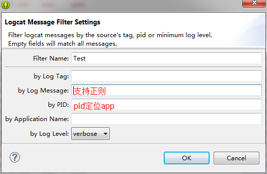
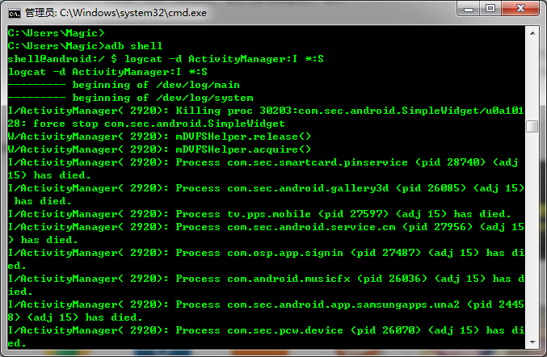
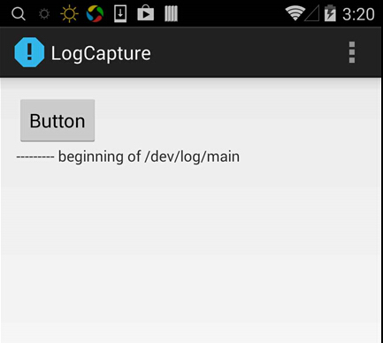
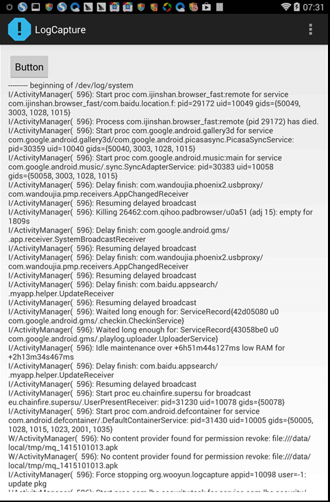
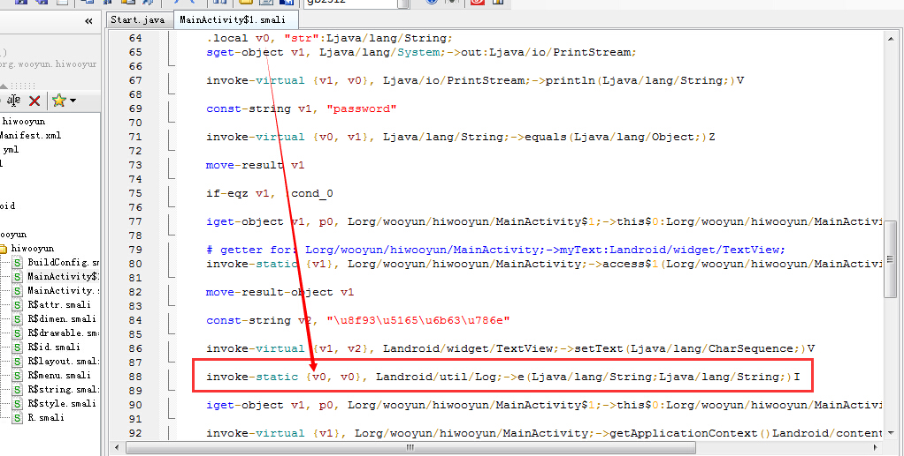
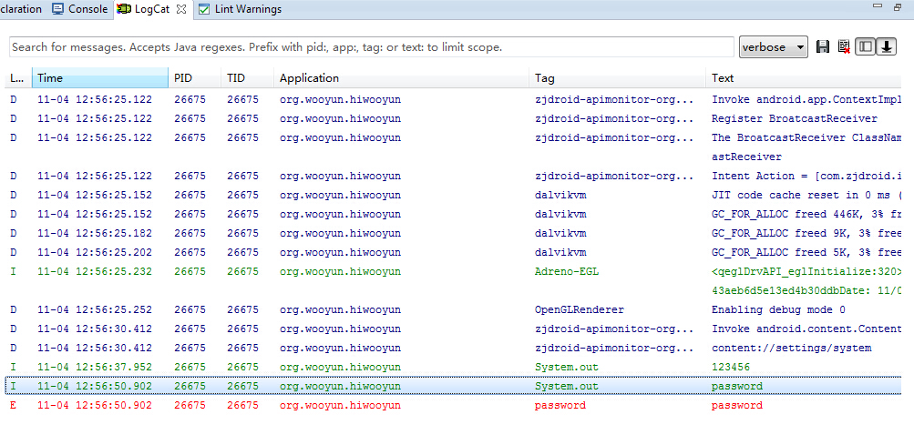
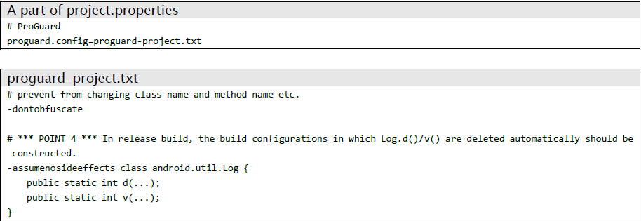
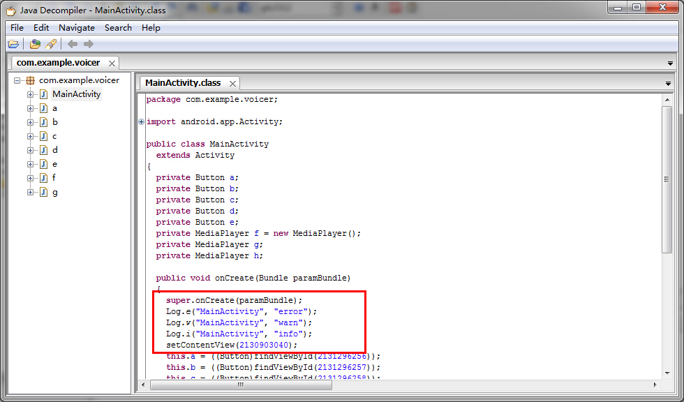

# Android Logcat Security

---

**Author:瘦蛟舞**

**Create:20141103**

[[toc]]

## 0x00 科普

---

development version ：开发版，正在开发内测的版本。

release version ： 发行版，签名后开发给用户的正式版本。

有些人认为任何log都不应该在发行版本打印。但是为了app的错误采集，异常反馈，必要的日志还是要被输出的，只要遵循安全编码规范就可以将风险控制在最小范围。

android.util.Log：提供了五种输出日志的方法

Log.e(), Log.w(), Log.i(), Log.d(), Log.v()

ERROR, WARN, INFO, DEBUG, VERBOSE

android.permission.READ_LOGS:app读取日志权限，android 4.1之前版本通过申请READ_LOGS权限就可以读取其他应用的log了。但是谷歌发现这样存在安全风险，于是android 4.1或之后版本，即使申请了READ_LOGS权限也无法读取其他应用的日志信息了。4.1版本中 Logcat的签名变为“signature|system|development”了，这意味着只有系统签名的app或者root权限的app才能使用该权限。普通用户可以通过ADB查看所有日志。

## 0x01 测试

---

测试方法是非常简单的，可以使用sdk中的小工具monitor或者ADT中集成的logcat来查看日志，将工具目录加入环境变量用起来比较方便。当然如果你想更有bigger也可以使用adb logcat。android整体日志信息量是非常大的，想要高效一些就必须使用filter来过滤一些无关信息，filter是支持正则的，可以做一些关键字匹配比如password、token、email等。本来准备想做个小工具自动化收集，但是觉得这东西略鸡肋没太大必要，故本文的重点也是在如何安全的使用logcat方面。





当然也可以自己写个app在直接在手机上抓取logcat，不过前面提到因为android系统原因如果手机是android4.1或者之后版本即使在manifest.xml中加入了如下申请也是无法读取到其他应用的log的。

    <uses-permission android:name="android.permission.READ_LOGS"/>



root权限可以随便看logcat



## 0x02 smali注入logcat

----------
http://drops.wooyun.org/tips/2986 一文中提到将敏感数据在加密前打印出来就是利用静态smali注入插入了logcat方法。
使用APK改之理smali注入非常方便，但要注意随意添加寄存器可能破坏本身逻辑，新手建议不添加寄存器直接使用已有的寄存器。

	invoke-static {v0, v0}, Landroid/util/Log;->e(Ljava/lang/String;Ljava/lang/String;)I





## 0x03 建议

Log.e()/w()/i()：建议打印操作日志

Log.d()/v()：建议打印开发日志

1、敏感信息不应用Log.e()/w()/i(), System.out/err 打印。

2、如果需要打印一些敏感信息建议使用 Log.d()/v()。（前提：release版本将被自动去除）

    @Override
    public void onCreate(Bundle savedInstanceState) {
    super.onCreate(savedInstanceState);
    setContentView(R.layout.activity_proguard);
    // *** POINT 1 *** Sensitive information must not be output by Log.e()/w()/i(), System.out/err.
    Log.e(LOG_TAG, "Not sensitive information (ERROR)");
    Log.w(LOG_TAG, "Not sensitive information (WARN)");
    Log.i(LOG_TAG, "Not sensitive information (INFO)");
    // *** POINT 2 *** Sensitive information should be output by Log.d()/v() in case of need.
    // *** POINT 3 *** The return value of Log.d()/v()should not be used (with the purpose of substitution or comparison).
    Log.d(LOG_TAG, "sensitive information (DEBUG)");
    Log.v(LOG_TAG, "sensitive information (VERBOSE)");
    }

3、Log.d()/v()的返回值不应被使用。（仅做开发调试观测）

Examination code which Log.v() that is specifeied to be deleted is not deketed

    int i = android.util.Log.v("tag", "message");
    System.out.println(String.format("Log.v() returned %d. ", i)); //Use the returned value of Log.v() for examination

4、release版apk实现自动删除Log.d()/v()等代码。

eclipse中配置ProGuard



开发版所有log都打印出来了。


发行版ProGuard移除了d/v的log


反编译后查看确实被remove了



5、公开的APK文件应该是release版而不是development版。

## 0x04 native code

android.util.Log的构造函数是私有的，并不会被实例化，只是提供了静态的属性和方法。
而android.util.Log的各种Log记录方法的实现都依赖于native的实现println\_native()，Log.v()/Log.d()/Log.i()/Log.w()/Log.e()最终都是调用了println\_native()。

Log.e(String tag, String msg)

    public static int v(String tag, String msg) {
        return println_native(LOG_ID_MAIN, VERBOSE, tag, msg);
    }

println\_native(LOG\_ID\_MAIN, VERBOSE, tag, msg)

	/*
	 * In class android.util.Log:
	 *  public static native int println_native(int buffer, int priority, String tag, String msg)
	 */
	static jint android_util_Log_println_native(JNIEnv* env, jobject clazz,
	    jint bufID, jint priority, jstring tagObj, jstring msgObj)
	{
	const char* tag = NULL;
	const char* msg = NULL;
	
	if (msgObj == NULL) {
	    jniThrowNullPointerException(env, "println needs a message");
	    return -1;
	}
	
	if (bufID < 0 || bufID >= LOG_ID_MAX) {
	    jniThrowNullPointerException(env, "bad bufID");
	    return -1;
	}

	if (tagObj != NULL)
	    tag = env->GetStringUTFChars(tagObj, NULL);
	msg = env->GetStringUTFChars(msgObj, NULL);
	
	int res = __android_log_buf_write(bufID, (android_LogPriority)priority, tag, msg);

	if (tag != NULL)
	    env->ReleaseStringUTFChars(tagObj, tag);
	env->ReleaseStringUTFChars(msgObj, msg);
	
	return res;
	}

其中\_\_android\_log\_buf\_write()又调用了write\_to\_log函数指针。

	static int __write_to_log_init(log_id_t log_id, struct iovec *vec, size_t nr)
	{
	#ifdef HAVE_PTHREADS
	    pthread_mutex_lock(&log_init_lock);
	#endif
	
	    if (write_to_log == __write_to_log_init) {
	        log_fds[LOG_ID_MAIN] = log_open("/dev/"LOGGER_LOG_MAIN, O_WRONLY);
	        log_fds[LOG_ID_RADIO] = log_open("/dev/"LOGGER_LOG_RADIO, O_WRONLY);
	        log_fds[LOG_ID_EVENTS] = log_open("/dev/"LOGGER_LOG_EVENTS, O_WRONLY);
	        log_fds[LOG_ID_SYSTEM] = log_open("/dev/"LOGGER_LOG_SYSTEM, O_WRONLY);

	        write_to_log = __write_to_log_kernel;

	        if (log_fds[LOG_ID_MAIN] < 0 || log_fds[LOG_ID_RADIO] < 0 ||
                log_fds[LOG_ID_EVENTS] < 0) {
	            log_close(log_fds[LOG_ID_MAIN]);
	            log_close(log_fds[LOG_ID_RADIO]);
	            log_close(log_fds[LOG_ID_EVENTS]);
	            log_fds[LOG_ID_MAIN] = -1;
	            log_fds[LOG_ID_RADIO] = -1;
	            log_fds[LOG_ID_EVENTS] = -1;
	            write_to_log = __write_to_log_null;
	        }

	        if (log_fds[LOG_ID_SYSTEM] < 0) {
	            log_fds[LOG_ID_SYSTEM] = log_fds[LOG_ID_MAIN];
	        }
	    }

	#ifdef HAVE_PTHREADS
	    pthread_mutex_unlock(&log_init_lock);
	#endif

	    return write_to_log(log_id, vec, nr);
	}

总的来说println\_native()的操作就是打开设备文件然后写入数据。


## 0x05 其他注意

----------

1、使用Log.d()/v()打印异常对象。（如SQLiteException可能导致sql注入的问题）

2、使用android.util.Log类的方法输出日志，不推荐使用System.out/err

3、使用BuildConfig.DEBUG ADT的版本不低于21
	
	public final static boolean DEBUG = true;

在release版本中会被自动设置为false
	
	if (BuildConfig.DEBUG) android.util.Log.d(TAG, "Log output information");


4、启动Activity的时候，ActivityManager会输出intent的信息如下：

- 目标包名
- 目标类名
- intent.setData(URL)的URL


5、即使不用System.out/err程序也有可能输出相关信息，如使用 Exception.printStackTrace()

6、ProGuard不能移除如下log：("result:" + value).

	Log.d(TAG, "result:" + value);

当遇到此类情况应该使用BulidConfig（注意ADT版本）

	if (BuildConfig.DEBUG) Log.d(TAG, "result:" + value);


## 0x06 乌云案例
----------

http://wooyun.github.io/bugs/wooyun-2014-079241

http://wooyun.github.io/bugs/wooyun-2010-079357

## 0x07 逆向随笔update


* 很多app会做写一个LogUtil类并且做一个开关filed.在dev版本中打开,release版本中关闭.这样做貌似很科学,但是也给他人逆向留下个快捷插桩途径.逆向人员只需要注入开关filed即可快速得到开发预留的logcat信息.更好的做法应该是在release版本中结合Proguard移除crash error外的日志.
* logcat硬编码TAG会给逆向恢复类名带来遍历,建议使用```MyClass.class.getSimpleName();```
* 重写toString方法也会破坏混淆的效果,注意尽量减少硬编码的使用.
*  ```Proguard rule -keepattributes SourceFile``` LineNumberTableProguard默认会移除这一行,但是某些app为了收集详细的错误日志用于调试bug而开启了如上属性.这样通用会破坏混淆效果.


## 0x08 参考

----------

[http://www.jssec.org/dl/android_securecoding_en.pdf](http://www.jssec.org/dl/android_securecoding_en.pdf)

[http://source.android.com/source/code-style.html#log-sparingly](http://source.android.com/source/code-style.html#log-sparingly)

[http://developer.android.com/intl/zh-cn/reference/android/util/Log.html](http://developer.android.com/intl/zh-cn/reference/android/util/Log.html)

[http://developer.android.com/intl/zh-cn/tools/debugging/debugging-log.html](http://developer.android.com/intl/zh-cn/tools/debugging/debugging-log.html)

[http://developer.android.com/intl/zh-cn/tools/help/proguard.html](http://developer.android.com/intl/zh-cn/tools/help/proguard.html)

[https://www.securecoding.cert.org/confluence/display/java/DRD04-J.+Do+not+log+sensitive+information](https://www.securecoding.cert.org/confluence/display/java/DRD04-J.+Do+not+log+sensitive+information)

[https://android.googlesource.com/platform/frameworks/base.git/+/android-4.2.2_r1/core/jni/android_util_Log.cpp](https://android.googlesource.com/platform/frameworks/base.git/+/android-4.2.2_r1/core/jni/android_util_Log.cpp)