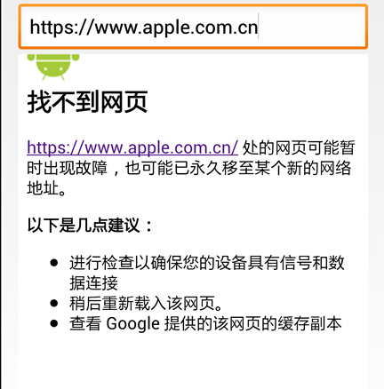
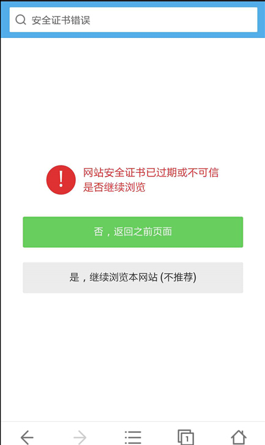
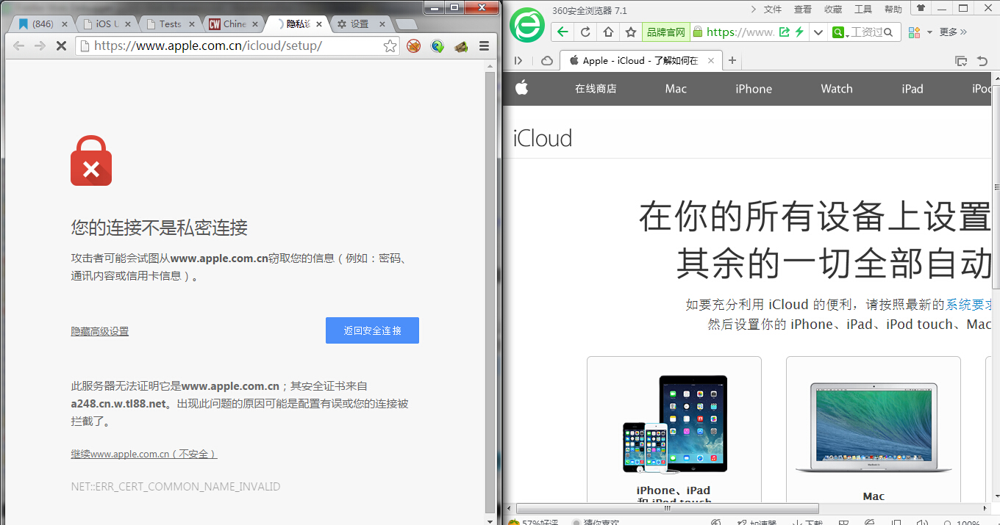
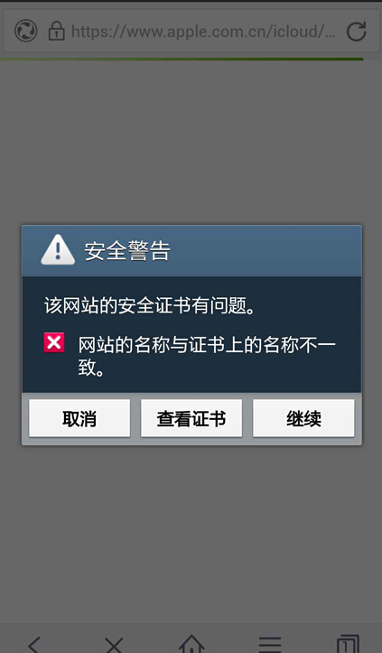
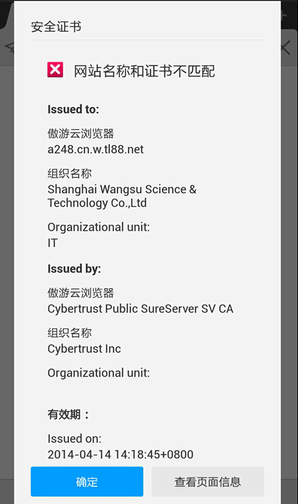
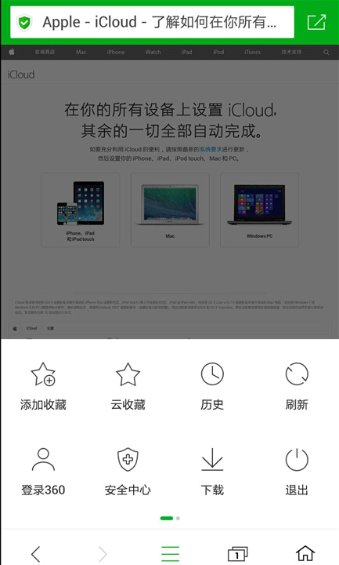
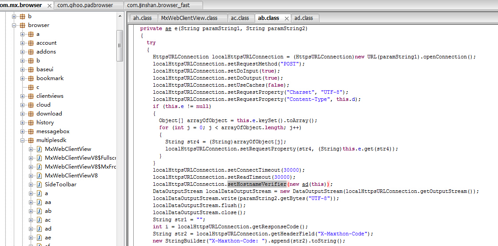
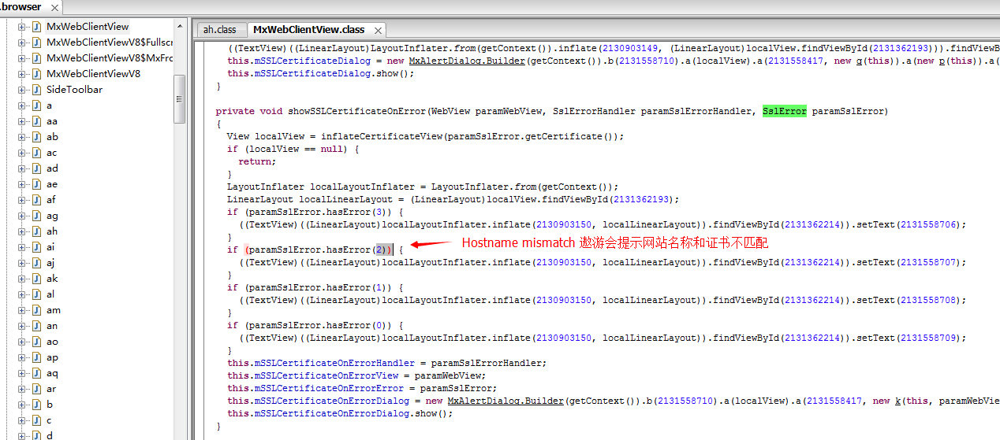
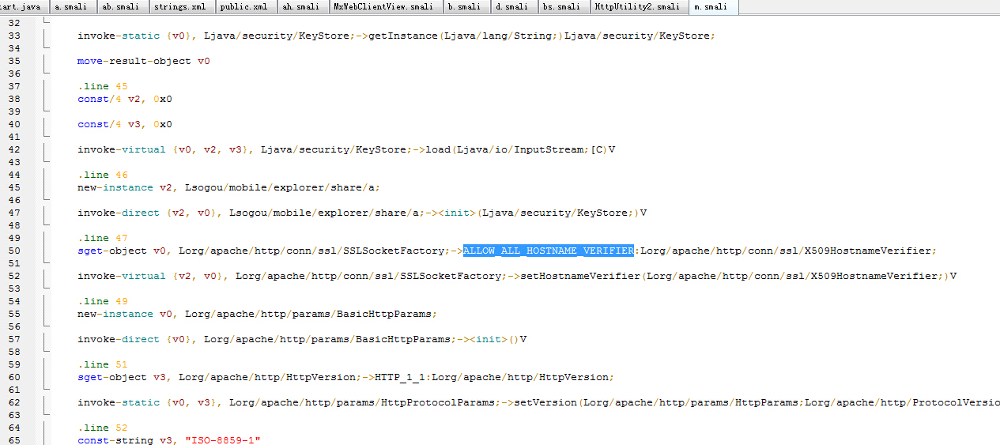

# Android证书信任问题与大表哥

**Author:瘦蛟舞**

**Create:20141021**

---

## 0x00 起因

----------

1、近期icloud.com、yahoo.com、apple.com遭遇到大规模劫持

http://www.wooyun.org/bugs/wooyun-2010-080117

2、乌云平台、CVE都收到大量有关Android APP信任所有证书的漏洞

http://www.wooyun.org/bugs/wooyun-2010-079358

3、老外写有关大表哥的文章中提到MITM时360浏览器不提示证书错误

[http://www.computerworld.com/article/2836084/chinese-big-brother-launches-nationwide-attack-on-icloud.html](http://www.computerworld.com/article/2836084/chinese-big-brother-launches-nationwide-attack-on-icloud.html)

之前信任证书问题一直都有被提到，但是普遍不受大家重视，因为这个漏洞是利用是需要场景的：MITM（中间人攻击 Man-in-the-middle attack）。一般情况下MITM相对其他攻击是比较少见的，如果有良好的上网习惯如不接入不受信任的网络，那就更少可能受此类攻击了。但是近期发生的MITM据传是在核心骨干网BGP上做了改动所以劫持范围非常之广，真是防不胜防呀，你被劫持了么？

## 0x01 科普

----------

**https&&ssl**

为了提高网站的安全性，一般会在比较敏感的部分页面采用https传输，比如注册、登录、控制台等。像Gmail、网银、icloud等则全部采用https传输。https/ssl主要起到两个作用：网站认证、内容加密传输和数据一致性。经CA签发的证书才起到认证可信的作用，所有有效证书均可以起到加密传输的作用。

**数字证书**

主要在互联网上的用于身份验证的用途。 安全站点在获得CA（Certificate Authority数字证书认证机构）认证后，获得一个数字证书，以此来标识其合法身份的真实性。数字证书主要分为服务器证书和客户端证书。服务器证书（SSL证书）用来进行身份验证和通信的加密，客户端证书主要用于身份验证和电子签名。找CA申请证书是要收费的。

**自签名证书**

非CA颁发的证书，通过自签名的方式得到的证书。通常Web浏览器会显示一个对话框，询问您是否希望信任一个自签名证书。这个是不用花钱的。

**中间人攻击**

是指攻击者与通讯的两端分别创建独立的联系，并交换其所收到的数据，使通讯的两端认为他们正在通过一个私密的连接与对方直接对话，但事实上整个会话都被攻击者完全控制。在中间人攻击中，攻击者可以拦截通讯双方的通话并插入新的内容。在许多情况下这是很简单的。

##0x02 分析

----------

如果自己简单的实现android webview加载网页，如果直接访问可信证书的站点是可以正常显示，但是如果访问自签名的证书的站点就会显示notfound的页面。(写本文时apple.com以及apple.com.cn处于劫持状态)



logcat会输出网页显示不安全的内容

	Web Console:The page displayed insecure content!

功能健全的手机浏览器访问自签名证书的站点会如下提醒



在PC端如果访问自签名证书的站点则会出现如下图左侧的提醒



为解决`javax.net.ssl.SSLPeerUnverifiedException: No peer certificate`的异常，开发者往往会采用以下的错误解决方案。如此是浏览器应用采用此类解决方案，那么风险就更大了。

覆盖google默认的证书检查机制

	class bv
	  implements X509TrustManager
	{
	  bv(bu parambu) {}
	  
	  public void checkClientTrusted(X509Certificate[] paramArrayOfX509Certificate, String paramString) {}
  
	  public void checkServerTrusted(X509Certificate[] paramArrayOfX509Certificate, String paramString) {}
  
	  public X509Certificate[] getAcceptedIssuers()
	  {
	    return null;
	  }
	}

信任所有主机名

	public static HttpClient getNewHttpClient() {  
        try {  
			//获得密匙库
            KeyStore trustStore = KeyStore.getInstance(KeyStore.getDefaultType());  
            trustStore.load(null, null);  
            
            SSLSocketFactory sf = new SSLSocketFactoryEx(trustStore); 
			//信任所有主机名 
            sf.setHostnameVerifier(SSLSocketFactory.ALLOW_ALL_HOSTNAME_VERIFIER);  
    
            HttpParams params = new BasicHttpParams();  
            HttpProtocolParams.setVersion(params, HttpVersion.HTTP_1_1);  
            HttpProtocolParams.setContentCharset(params, HTTP.UTF_8);  
    
            SchemeRegistry registry = new SchemeRegistry();  
            registry.register(new Scheme("http", PlainSocketFactory.getSocketFactory(), 80));  
            registry.register(new Scheme("https", sf, 443));  
    
            ClientConnectionManager ccm = new ThreadSafeClientConnManager(params, registry);  
    
            return new DefaultHttpClient(ccm, params);  
        } catch (Exception e) {  
            return new DefaultHttpClient();  
        }  
    }  


其实早在14年2月[窃听风暴： Android平台https嗅探劫持漏洞](http://drops.wooyun.org/papers/959)文中就有提到android平台的app因为覆盖google默认的证书检查机制（X509TrustManager）之后没有对证书进行应有的安全性检查，直接接受了所有异常的https证书，不提醒用户存在安全风险，也不终止这次危险的连接。文中对证书域名检查（HostnameVerifier）部分没有细说。

上文有提到PC版的360浏览器访问被劫持网站居然没有证书错误提示，让人很不敢相信。加上最近android app 证书问题频发，猜想是否有可能一些手机浏览器也会有此类漏洞了。测试过程中发现360手机浏览器、和搜狗浏览器存在此风险。

百度和遨游轻松检测出证书异常





而360和搜狗直接加载进入了被劫持的网站。




反编译查看遨游浏览器的代码，针对sslerror做了处理





而搜狗浏览器则是做了证书信任所有主机名不当处理



## 0x03 对比

对主流手机浏览器进行了横向对比，测试对象包括：firefox、chrome、UC浏览器、搜狗浏览器、百度浏览器、360安全浏览器、欧鹏浏览器、遨游云浏览器、猎豹浏览器。

测试方法：手机访问[https://example.com/](https://example.com/),观察是否有安全提醒。(失效)

未做提醒直接加载网页：360安全浏览器、猎豹浏览器、搜狗浏览器

正常做出安全提醒：firefox、chrome、UC浏览器、百度浏览器、欧鹏浏览器、遨游云浏览器

## 0x04 建议

----------
关键字：checkServerTrusted、setHostnameVerifier、ALLOW\_ALL\_HOSTNAME\_VERIFIER、X509TrustManager、onReceivedSslError 

开发者：

1、非浏览器app，有钱申请ca证书没钱在客户端中添加证书,切勿信任所有证书。

2、浏览器app，严格按照客户端校验服务器证书流程处理:

- 查看证书是否过期 
- CA是否可靠 
- CA的公钥能否正确解开服务器证书的CA数字签名，即证书的签名值 
- 服务器证书上的域名是否和服务器的实际域名相匹配

3、建议使用setHostnameVerifier(SSLSocketFactory.STRICT\_HOSTNAME\_VERIFIER)

```java
java public class SecureSocketFactory extends SSLSocketFactory {

    private static final String LOG_TAG = "SecureSocketFactory";

    private final SSLContext sslCtx;
    private final X509Certificate[] acceptedIssuers;

    /**
     * Instantiate a new secured factory pertaining to the passed store. Be sure to initialize the
     * store with the password using [email protected] java.security.KeyStore#load(java.io.InputStream,
     * char[])} method.
     *
     * @param store The key store holding the certificate details
     * @param alias The alias of the certificate to use
     */
    public SecureSocketFactory(KeyStore store, String alias)
            throws
            CertificateException,
            NoSuchAlgorithmException,
            KeyManagementException,
            KeyStoreException,
            UnrecoverableKeyException {

        super(store);

        // Loading the CA certificate from store.
        final Certificate rootca = store.getCertificate(alias);

        // Turn it to X509 format.
        InputStream is = new ByteArrayInputStream(rootca.getEncoded());
        X509Certificate x509ca = (X509Certificate) CertificateFactory.getInstance("X.509").generateCertificate(is);
        AsyncHttpClient.silentCloseInputStream(is);

        if (null == x509ca) {
            throw new CertificateException("Embedded SSL certificate has expired.");
        }

        // Check the CA's validity.
        x509ca.checkValidity();

        // Accepted CA is only the one installed in the store.
        acceptedIssuers = new X509Certificate[]{x509ca};

        sslCtx = SSLContext.getInstance("TLS");
        sslCtx.init(
                null,
                new TrustManager[]{
                        new X509TrustManager() {
                            @Override
                            public void checkClientTrusted(X509Certificate[] chain, String authType) throws CertificateException {
                            }

                            @Override
                            public void checkServerTrusted(X509Certificate[] chain, String authType) throws CertificateException {
                                Exception error = null;

                                if (null == chain || 0 == chain.length) {
                                    error = new CertificateException("Certificate chain is invalid.");
                                } else if (null == authType || 0 == authType.length()) {
                                    error = new CertificateException("Authentication type is invalid.");
                                } else {
                                    Log.i(LOG_TAG, "Chain includes " + chain.length + " certificates.");
                                    try {
                                        for (X509Certificate cert : chain) {
                                            Log.i(LOG_TAG, "Server Certificate Details:");
                                            Log.i(LOG_TAG, "---------------------------");
                                            Log.i(LOG_TAG, "IssuerDN: " + cert.getIssuerDN().toString());
                                            Log.i(LOG_TAG, "SubjectDN: " + cert.getSubjectDN().toString());
                                            Log.i(LOG_TAG, "Serial Number: " + cert.getSerialNumber());
                                            Log.i(LOG_TAG, "Version: " + cert.getVersion());
                                            Log.i(LOG_TAG, "Not before: " + cert.getNotBefore().toString());
                                            Log.i(LOG_TAG, "Not after: " + cert.getNotAfter().toString());
                                            Log.i(LOG_TAG, "---------------------------");

                                            // Make sure that it hasn't expired.
                                            cert.checkValidity();

                                            // Verify the certificate's public key chain.
                                            cert.verify(rootca.getPublicKey());
                                        }
                                    } catch (InvalidKeyException e) {
                                        error = e;
                                    } catch (NoSuchAlgorithmException e) {
                                        error = e;
                                    } catch (NoSuchProviderException e) {
                                        error = e;
                                    } catch (SignatureException e) {
                                        error = e;
                                    }
                                }
                                if (null != error) {
                                    Log.e(LOG_TAG, "Certificate error", error);
                                    throw new CertificateException(error);
                                }
                            }

                            @Override
                            public X509Certificate[] getAcceptedIssuers() {
                                return acceptedIssuers;
                            }
                        }
                },
                null
        );

        setHostnameVerifier(SSLSocketFactory.STRICT_HOSTNAME_VERIFIER);
    }

    @Override
    public Socket createSocket(Socket socket, String host, int port, boolean autoClose)
            throws IOException {

        injectHostname(socket, host);
        Socket sslSocket = sslCtx.getSocketFactory().createSocket(socket, host, port, autoClose);

        // throw an exception if the hostname does not match the certificate
        getHostnameVerifier().verify(host, (SSLSocket) sslSocket);

        return sslSocket;
    }

    @Override
    public Socket createSocket() throws IOException {
        return sslCtx.getSocketFactory().createSocket();
    }

    /**
     * Pre-ICS Android had a bug resolving HTTPS addresses. This workaround fixes that bug.
     *
     * @param socket The socket to alter
     * @param host   Hostname to connect to
     * @see <a href="https://code.google.com/p/android/issues/detail?id=13117#c14">https://code.google.com/p/android/issues/detail?id=13117#c14</a>
     */
    private void injectHostname(Socket socket, String host) {
        try {
            if (Integer.valueOf(Build.VERSION.SDK) >= 4) {
                Field field = InetAddress.class.getDeclaredField("hostName");
                field.setAccessible(true);
                field.set(socket.getInetAddress(), host);
            }
        } catch (Exception ignored) {
        }
    }


} 
```

##0x05 参考

[http://drops.wooyun.org/tips/2775](http://drops.wooyun.org/tips/2775 "http://drops.wooyun.org/tips/2775")

[http://drops.wooyun.org/papers/959](http://drops.wooyun.org/papers/959 "http://drops.wooyun.org/papers/959")

[http://developer.android.com/reference/javax/net/ssl/HttpsURLConnection.html](http://developer.android.com/reference/javax/net/ssl/HttpsURLConnection.html "http://developer.android.com/reference/javax/net/ssl/HttpsURLConnection.html")

[http://developer.android.com/reference/javax/net/ssl/X509TrustManager.html](http://developer.android.com/reference/javax/net/ssl/X509TrustManager.html)

[http://developer.android.com/training/articles/security-ssl.html](http://developer.android.com/training/articles/security-ssl.html)

[developer.android.com/reference/org/apache/http/conn/ssl/SSLSocketFactory.html](developer.android.com/reference/org/apache/http/conn/ssl/SSLSocketFactory.html)